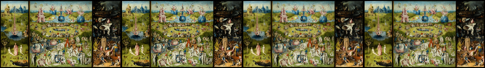

# Hybrid cropper: 6.17 kB with restored quality and coverage

The hybrid combines the lean prototype's single affine model with progressive native export, arbitrary-angle image coverage, circle/ellipse masks, proportional sizing, and optional production EXIF reporting. Its **widget, exporter, and required CSS total 6,172 bytes gzip9**. The production package remains unchanged; this is an isolated candidate interface, not a Croppie-compatible release.

[Run and interface guide](../lean-cropper/README.md) · [Recorded parent verification](../lean-cropper/recorded/hybrid-verification.json) · [Desktop](../lean-cropper/recorded/hybrid-desktop.png) · [Mobile layout](../lean-cropper/recorded/hybrid-mobile.png)

## Payload and implementation

Measured with Bun **1.4.2**, Node **24.16.0**, zlib **1.3.1-e00f703**, gzip level 9, and separately compressed response bodies. No source maps, runtime dependencies, worker, WASM, or fetched font bytes are hidden. Byte counts are for selected loading graphs; the demo bundles core/export once.

| Browser asset | Raw bytes | gzip9 bytes |
| --- | ---: | ---: |
| Core: state, constraints, input, DOM, lifetime | 11,565 | 4,293 |
| Quality exporter and its geometry/resampling helpers | 2,705 | 1,285 |
| Required widget CSS | 1,408 | 594 |
| **Embeddable component** | **15,678** | **6,172** |
| **Component plus optional JPEG metadata module** | **16,818** | **6,769** |

The optional metadata entry adds 1,140 raw / **597 gzip bytes**. The complete demo adds its control panel, HTML, page styling and sample: **26,198 raw / 10,152 gzip bytes**; excluding only the sample yields 9,733 gzip bytes. Test-only production/DOMMatrix bundles are not requested by the demo. Exact hashes and loading graphs are in the recorded JSON.

The earlier lean component was 4,627 gzip bytes. Restoring these behaviors costs **1,545 bytes**, inside the proposed 6–7 kB component budget. The existing production package is 9,020 gzip bytes, but it has a different interface and compatibility contract; these figures do not establish a drop-in replacement saving.

The hybrid source is based on `a006080` and integrated through `a2286b3`; `8e6923f` makes Circle automatically select and lock Square in the demo, while keeping Ellipse available. This toolbar change leaves the component payload unchanged. Two supervised Orca workers owned coverage/core and quality export; the parent reviewed, integrated, independently reran their checks, and added demo, metadata, and reliability validation. Both worker terminals were released after acceptance. Nothing was pushed or published.

## What now works

1. **Filled crops at arbitrary angles.** Fill is the default. The solver inverse-projects viewport corners into source coordinates, adjusts minimum zoom and pan, and handles reflections and valid shear. It does not mistake the rotated image's bounding box for image coverage. Below-minimum zoom attempts do not drift. Tiny images can exceed the normal zoom ceiling when coverage requires it. Explicit free mode permits transparent edges.
2. **One state for preview and export.** The six-number source-to-stage matrix remains authoritative. Optional version-1 mask state defaults to rectangle for old saved states; circle means the inscribed ellipse. Preview, export, reset, restore, resize and controls agree. Coverage is instance policy; saved geometry is restored under the currently selected policy.
3. **Quality by default.** Export selects the relevant original-image region with filter support, progressively halves it, then applies the affine map. Full-photo tests match the actual production renderer. Crop proportions are preserved for mismatched output dimensions; pixel-rounded matching shapes fill without a faint border. Valid oversized requests are capped proportionally; invalid sizes reject before allocation.
4. **Explicit ownership and failure behavior.** Original image/Blob and caller-owned canvases stay intact. Only private final Blob-output canvases are cleared after encoding; intermediate canvases are not reset. Invalid non-URL input is browser-brand-validated before it can cancel a valid pending load. The demo ignores both successful and failed exports superseded by an image change.
5. **Optional metadata, required visual orientation.** A separate entry reuses the tested, bounded production JPEG reader. Neither core nor exporter imports it. Native image decoding handles EXIF display once; the reader only reports the tag. The parent tested both Blob and byte readers for tags 1–8 in each engine.

## Independent verification

All parent runs used the integrated files, installed Chromium **153.0.8010.12**, Firefox **155.0**, and Playwright WebKit **26.6**. Servers use dedicated ports; no worker's server or build artifacts were reused as a test target.

| Parent check | Result |
| --- | --- |
| Strict experimental TypeScript | Pass |
| Existing model checks | 4,969 assertions, 400 seeded transforms, 60 resize combinations |
| New coverage checks | 20,000 initialization cases; 5,040 seeded browser operations; 85,227 assertions; 504 minimum-tightness checks across three engines |
| Common browser/EXIF/geometry/lifetime checks | 40 scenarios and 63 independent pixel comparisons pass; original free-mode tests are explicitly free |
| Parent hybrid/default-mode checks | 3,728 corner assertions per engine, masks, resize, restore, no drift, 1×1 source, invalid inputs, pending-load preservation, letterboxing, successful/failed stale exports, and demo output pass |

The parent hybrid loop records **zero JavaScript Canvas allocations during interactions**. Preview remains CSS-based; this is not a claim that browser painting costs nothing or that frame rate improved. No hybrid throughput or physical-device memory claim is made.

The independently rerun exporter suite passes analytic solid/transparent-region placement, quarter-turn comparisons, arbitrary-angle/flipped/circular/fractional crops, original-resolution detail, encoder failure/lifetime handling, 9 quality scenarios and EXIF 1–8 in every engine. Two full-photo fixtures across three engines give **six exact production-pixel matches**. The 48MP fixture is a rescaled repository photograph, not original camera detail; a separate one-pixel artwork tests preserved detail.

All **878 production tests**, production lint and type checking pass. A direct diff against the starting commit shows no changes in production `src`, package configuration, or lockfile. The experimental API is not exported from the production package.

### Quality reference correction and results

The earlier common “progressive” reference zeroed intermediate canvases. Prior tests had already shown that those resets change WebKit pixels. The parent replaced that reference with a compiled test-only import of actual `src/canvas/draw.ts`; historical artifacts were preserved rather than rewritten.

For the 5120×2915 photo reduced to 320×182, mean absolute RGB error against the separate plain-Pillow-Lanczos reference is:

| Engine | Old single pass | Hybrid | Actual production | Hybrid vs production |
| --- | ---: | ---: | ---: | ---: |
| Chromium | 4.6721 | 5.4470 | 5.4470 | Exact pixels |
| Firefox | 11.6904 | 5.1705 | 5.1705 | Exact pixels |
| WebKit | 10.0438 | 4.5294 | 4.5294 | Exact pixels |

The large Firefox/WebKit aliasing gap is closed to production. Chromium's native high-quality single pass is slightly sharper for these photos; consistent production-style downsampling is not a universal improvement against every reference. The old reset-based WebKit 0.4401-MAE result is not the production target.

Arbitrary-angle geometry and resampling are tested separately. Native CSS and Canvas filtering need not produce identical edge pixels; independent geometry oracles and photo-quality gates prevent one from hiding errors in the other. Full-photo parity is exact. Some quarter-turn/fractional Firefox edges differ slightly because the hybrid preserves affine placement while production snaps certain edges; this is recorded, not described as universal byte parity. See the [export report](hybrid-export.md) for thresholds and measured limits, and the [coverage report](hybrid-coverage.md) for the constraint proof and numerical cases.

## Remaining limits and reproduction

This remains an experiment: no legacy Croppie adapter, undo/snapping, physical-phone or assistive-technology audit, global decode-memory budget, tiled output, or metadata/color-profile preservation is claimed. Circle coverage deliberately uses its rectangular frame. Strong restored shear/nonuniform scale is geometrically supported but can still alias; quality guarantees cover the uniform scale/rotation/reflection generated by the UI. Per-canvas limits are conservative guards, not a total mobile-memory guarantee.

The [README](../lean-cropper/README.md#verification) lists build and check commands. Parent raw evidence is in `.cache/hybrid/`; the compact durable snapshot and selected screenshots are in `recorded/hybrid-*`. `checks/hybrid.check.mjs` supplies the independent default-mode and demo gates; `checks/browser.check.mjs` retains explicit free-mode regression cases. `checks/quality.py` now fails on missing requested evidence and compares actual production, hybrid and single-pass outputs without resetting reference scratch surfaces.

Production adoption should follow a separate compatibility and device-validation decision. This iteration demonstrates that the smaller architecture can restore the two missing guarantees within the intended component budget.
